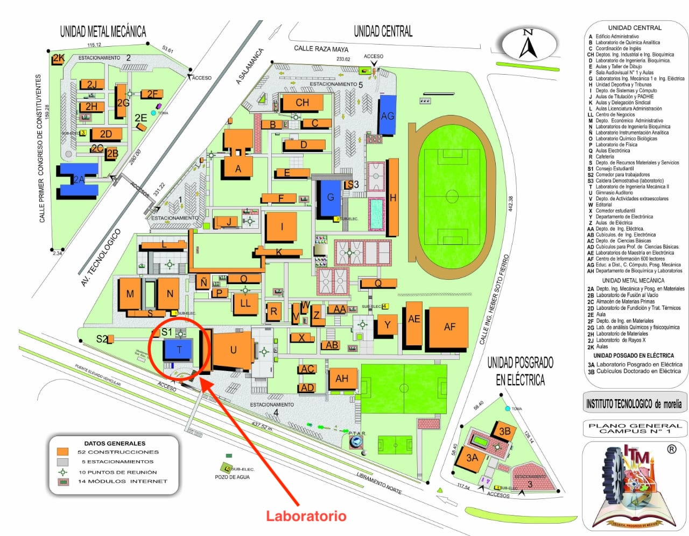

# Indicaciones Generales
Bienvenidos al **Laboratorio de Robótica** del Instituto Tecnológico de Morelia

Primero que nada espero que se encuentren muy bien, la materia se impartirá los días *Lunes de 15:00-17:00 para el grupo AA* y *Jueves de 09:00-11:00 para el grupo AB* 

El laboratorio se encuentra en el edificio T del Instituto como se muestra en la imagen

Los espero puntuales con laptop *(Windows)* para que podamos hacer la primera práctica que consta en la instalación del programa Epson RC+ y los primeros movimientos con el robot.

